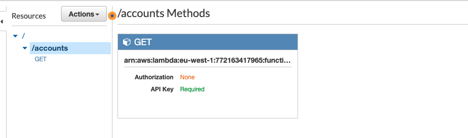

Accounts API (AWS) Lambda with Terraform
=================================

This project is deploying an API of a Python (AWS)
[Lambda](https://aws.amazon.com/lambda/) exposed with [API
Gateway](https://aws.amazon.com/api-gateway/), configured with
[Terraform](https://www.terraform.io/). 


## Introduction

This project creates a `/accounts` endpoint with two methods (`GET` and
`POST`). Both methods are bound to a **single file** containing two handlers
(a.k.a. lambda functions, one for each method). This is defined by a `handler`
parameter. The code for each lambda function is written in Python (method names
are just a convention):

```python
def gen_api_response(
        response_body, status_code=200):
    response = {
        "statusCode": status_code,
        "body": json.dumps(response_body),
    }
    log.info(f"Lambda Response: {response}")
    return response

```

<p> <span style="color:red"> Lambda Handler which deals with the request that comes from the API </span> </p>

```python
def handler(event, context):
    """
    Top level lambda handler
    """
    log.info(event)

    try:
        response = org_client.list_create_account_status()
        return gen_api_response(response_body={"Table Status": response['Table']['TableStatus']})

    except ClientError as e:
        if e.response['Error']['Code'] == "ResourceNotFoundException":
            status_code = 404
        else:
            status_code = 500

        data = {"ErrorMsg": "Table Not Found"}
        return gen_api_response(response_body=data, status_code=status_code)

    except Exception:
        return gen_api_response(response_body={"Internal Server Error"}, status_code=500)
```

The [Terraform configuration](main.tf) relies on modules:
[`api_method`](api_method/). See the [Terraform Modules
section](#terraform-modules) for further information. This configuration creates
two lambda functions on AWS Lambda, a (deployed) REST API with a single endpoint
and two HTTP methods on API Gateway, and takes care of the permissions and
credentials. The figure below is an example of what you get in the API Gateway
dashboard:




## Getting started

You must have an [AWS account](http://aws.amazon.com/). Next, you must [install
Terraform](https://www.terraform.io/intro/getting-started/install.html) first.

Clone this repository, then run:

    $ make get

Create a `terraform.tfvars` file with the content below. This step is optional
as Terraform will ask you to fill in the different values, but it is convenient.

```ini
aws_region     = "eu-west-1"
```

You are now ready to use Terraform!

    $ make plan

If everything is OK, you can build the whole infrastructure:

    $ make apply

You can destroy all the components by running:

    $ make destroy

For more information, please read [the Terraform
documentation](https://www.terraform.io/docs/index.html).


## Terraform Modules

### `lambda`

```hcl
data "archive_file" "zipit" {
  type        = "zip"
  source_dir  = "${path.module}/lambda"
  output_path = "${path.module}/lambda/monitoring_lambda.zip"
}

resource "aws_lambda_function" "status_tfe_lambda" {
  function_name    = "monitoring_get_lambda"
  handler          = "tfe_status.tfe_status_handler"
  role             = aws_iam_role.iam_role_for_lambda.arn
  runtime          = "python3.7"
  source_code_hash = data.archive_file.zipit.output_base64sha256
  filename         = data.archive_file.zipit.output_path
  environment {
    variables = {
      access_token = var.access_token
    }
  }

}
```

**Important:** this module assumes that the source file, the lambda (in AWS),
and the zip file have the **same name**. For example, we use `hello_lambda` in
this project. The `handler` parameter distinguishes the different lambda
functions that can be invoked.

### `api_method`

```hcl
module "status_dynamoDB" {
  source      = "./api_method"
  rest_api_id = aws_api_gateway_rest_api.portal_api.id
  resource_id = aws_api_gateway_resource.status_dynamodb_api_rest.id
  method      = "GET"
  path        = aws_api_gateway_resource.status_dynamodb_api_rest.path
  lambda      = aws_lambda_function.status_dynamodb_lambda.id
  region      = var.aws_region
  account_id  = data.aws_caller_identity.current.account_id
}
```

